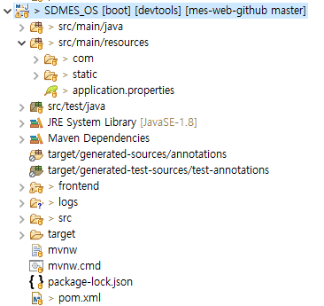
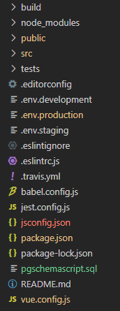
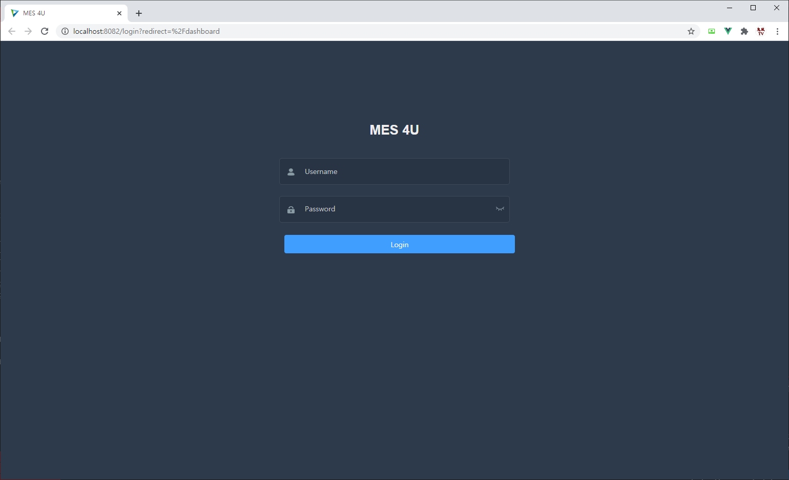
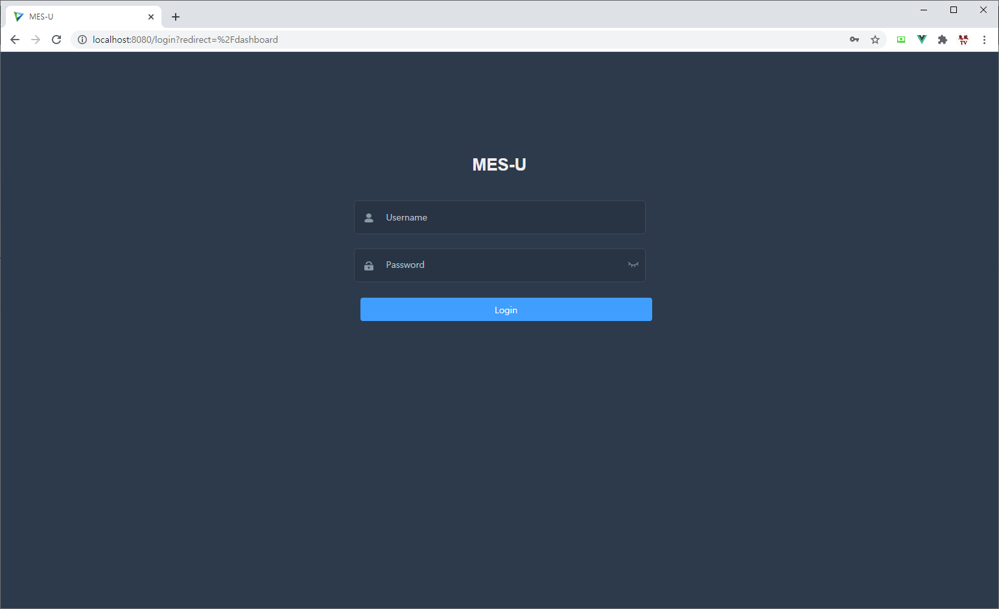

# Getting Started - Installation

Eng / [한글](./Installation.ko-KR.md)

## I. Clone Repository

Below is downloading source code.

```
git clone git@github.com:sindohmes/MESTEST
```

## II. PostgreSQL Setup

The first thing is to install PostgreSQL. The tested versions are listed as below. If you want to test another version, please contact us.

+ PostgreSQL 9.6.18 (OS: Red Hat 4.8.5-39, 64-bit)
+ PostgreSQL 9.6.19 (OS: Windows 10, 64-bit)
+ PostgreSQL 12.4 (OS: Windows 10, 64-bit)

[PostgreSQL Download Link](https://www.postgresql.org/download/)

After completing the installation, run pgAdmin. You can create a user and database using the below command.

```PostgreSQL
CREATE USER mesuser PASSWORD 'mesuser';
CREATE DATABASE sdmes OWNER 'mesuser';
ALTER DATABASE sdmes SET search_path TO sdmes;
```

You can use your own user and DB names other than 'mesuser' and 'sdmes'. In this case, however, DB Schema creation script and 'application.properties' file in Spring Framework should be modified accordingly.

After competing user and DB registration, download the schema creation script and run it in PostgreSQL. This script includes essential INSERT script for making system data including Table, View, Sequence, Function and Index.

[PostgreSQL Schema Creation Script Download Link](./pgschemascript.sql)

## III. Java Spring Framework Setting

mes4u is an open-source software built using Spring Framework. It is based on Maven project

For Running, default Java setting is jre 1.8 but need to change jdk 1.8. Change procedures are below.

+ Project Right Click - Properties
+ Java Build Path - Libraries Tab - JRE System Library - Edit
+ Alternae JRE: JRE -> JDK Change

The directory structure is below.



+ src/main/java: Back-end Java source code
+ src/main/resources/com: MyBatis XML 
+ src/main/resources/static: Front-end Deployment Directory
+ src/main/resources/application.properties: Spring configuration and PostgreSQL connection setup file
+ frontend: Front-end Vue.js source code and Front-end environments
+ target: deployment directory for WAR and Class
+ pom.xml: Maven Project configuration file

In the list above, you can check the configuration from 'application.properties' and 'pom.xml' files.

### 1. application.properties

This file specifies Spring Framework configuration data. It is mainly used for PostgreSQL connection.

```
spring.datasource.hikari.maximum-pool-size=4
spring.datasource.url=jdbc:postgresql://localhost:5434/sdmes
spring.datasource.username=mesuser
spring.datasource.password=mesuser

spring.datasource.tomcat.max-wait=10000
spring.datasource.tomcat.max-active=20

spring.jpa.properties.hibernate.jdbc.lob.non_contextual_creation= true
spring.jpa.properties.hibernate.dialect= org.hibernate.dialect.PostgreSQLDialect
spring.jpa.open-in-view=false

# Hibernate ddl auto (create, create-drop, validate, update)
spring.jpa.hibernate.ddl-auto= update
spring.data.jdbc.repositories.enabled=false

mybatis.mapper-locations=com/sindoh/sdmes/mapper/*.xml

# Project Custom Values
sdmes.datasource.db=sdmes
sdmes.app.jwtSecret=sdmes
sdmes.app.jwtExpirationMs=86400000
```


### 2. pom.xml

This file specifies libraries used by Spring Boot - Maven Project. Currently it includes the following libraries:

+ Spring JDBC
+ Spring JPA
+ Spring Security
+ Spring MyBatis
+ JsonWebtoken
+ Jackson
+ Devtools
+ PostgreSQL
+ Lombok
+ Swagger-UI

If you want to add more libraries, just add them into 'pom.xml'. After that, you must run 'Maven - Update Project' to download and use the libraries.

## IV. Vue.js Setting

Front-end Framework in mes4u is based on Vue.js and use npm for the installation and management. If you are unable to use npm, you must install node.js instead using the download link below.

[Node.js Downlaod Link](https://nodejs.org/ko/)

Since Java WAR file and Vue.js build deployment files have been already uploaded, you can see and test the web page without any additional setup. To modify Vue.js code, the following steps should be carried out.

+ Vue.js dev-environment installation
```
npm install
```

+ Vue.js dev-environment execution
```
npm run dev
```

+ Vue.js build and deployment
```
npm run build
```

Vue.js environment directory is organized as below.



+ build: used for build, should not be modified
+ node_modules: created when you install dev-environment; this directory does not exist in Git
+ public: public HTML file, should not be modified
+ src: Vue.js development source code files, adding or modifying codes is carried out in this directory
+ package.json: Vue.js libraries and configuration file
+ vue.config.js: dev and build environment file
+ .env.development: Base URL files to connect Back-end API in dev environment
+ .env.production: Base URL files to connect Back-end API in deployment environment

mes4u Vue.js uses the UI and Template below.

+ [Element UI: MIT License](https://element.eleme.io/#/en-US)
+ [vue-element-admin: MIT License](https://github.com/PanJiaChen/vue-element-admin)

## V. mes4u execution

mes4u can be executed by Spring Boot App of STS4 (Spring Tool Suite) or execute 'ROOT.war' file in 'target' directory.

```
java -jar ROOT.war
```

Default setup URL is http://localhost:8080. If you want to use another server, run it in Tomcat Server. When connected to http://localhost:8080, the following screen is shown.



After PostgreSQL installation and DB connection is completed, you can see the login page in Web. Log into mes4u using the default user name and password below.

+ ID: administrator
+ PW: administrator

After login, you are redirected to the main page where you can use various MES features.

