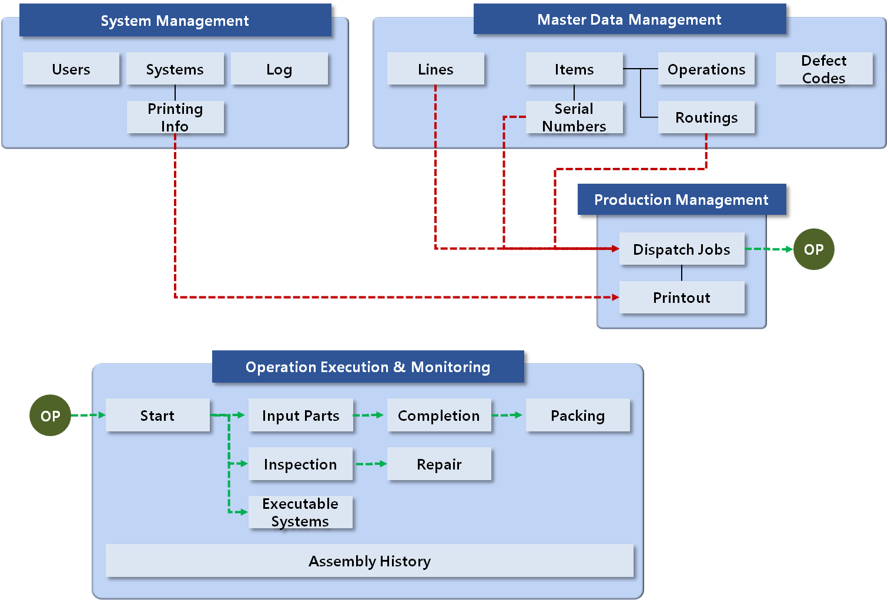

# Main features

Eng / [한글](./features.ko-KR.md)

## 1. Management Area and Processes

mes4u v1 provides core functions used on manufacturing execution systems. The core functions is classified into 4 categories as below.

+ System Management: User registration and related system, log information
+ Master Data Management: Master data of manufacturing
+ Production Management: Dispatch job order and printout
+ Operation Execution & Monitoring: Production activities in operations and inspection and repair in line, and monitoring

In this program MES processes is below.

The details for each management area are explained in the related pages below.

+ [System Management](./manual_system_mgmt.md)
+ [Master Data Management](./manual_mdm.md)
+ [Production Management](./manual_production_mgmt.md)
+ [Operation Execution & Monitoring](./manual_operation_exec.md)
  
## 2. Additional implementation plans

The current version (v1) has limited features, but in the future version, we'll extends its range of features by implementing the following:

A next version program will be developed by below.

+ Employee Management
+ Role Management
+ Site Management
+ Quality Management
+ Inventory and stock Management
+ Real-time manufacturing status board
+ Open source report system
+ Dynamic operation management
+ Manufacturing order management
+ Material and receiving management
+ Shipping Management

We welcome your comments, suggestions, and ideas for improvements. If you have any ideas or issues, please let us know.

