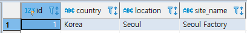
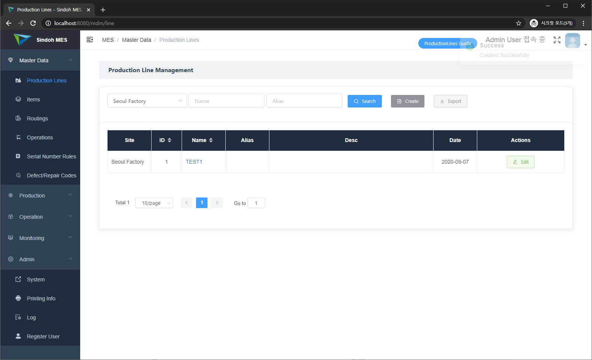
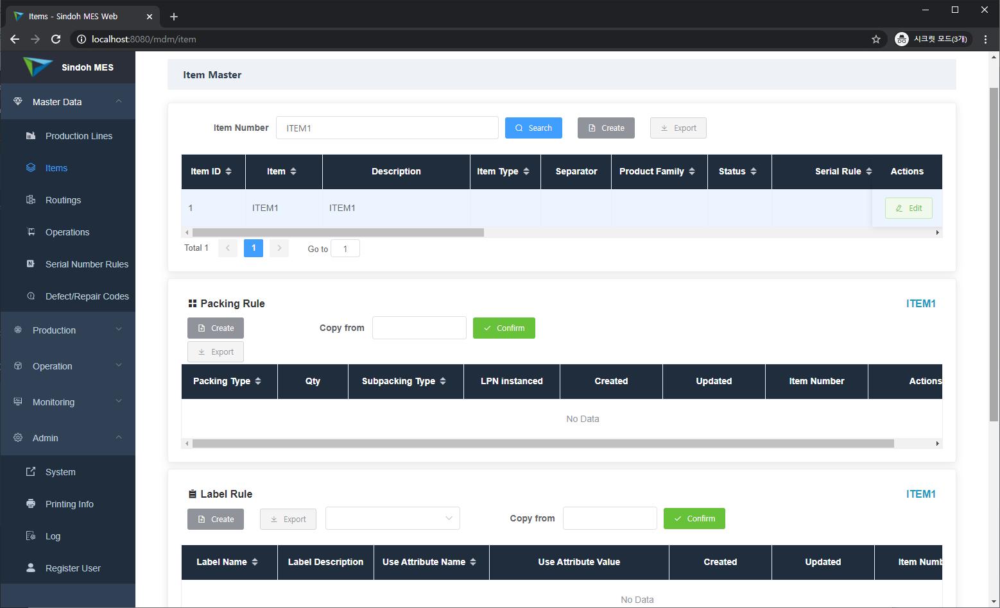
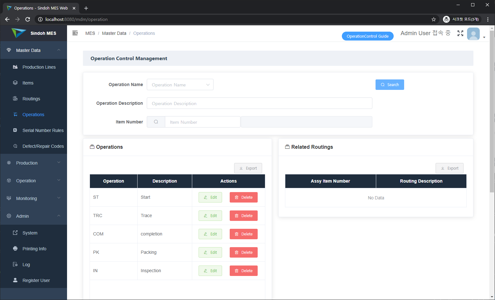
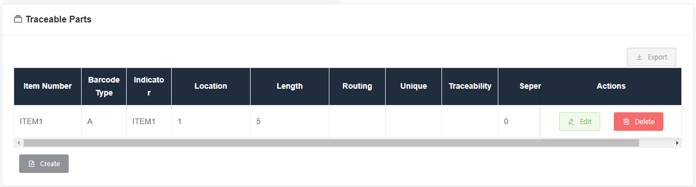
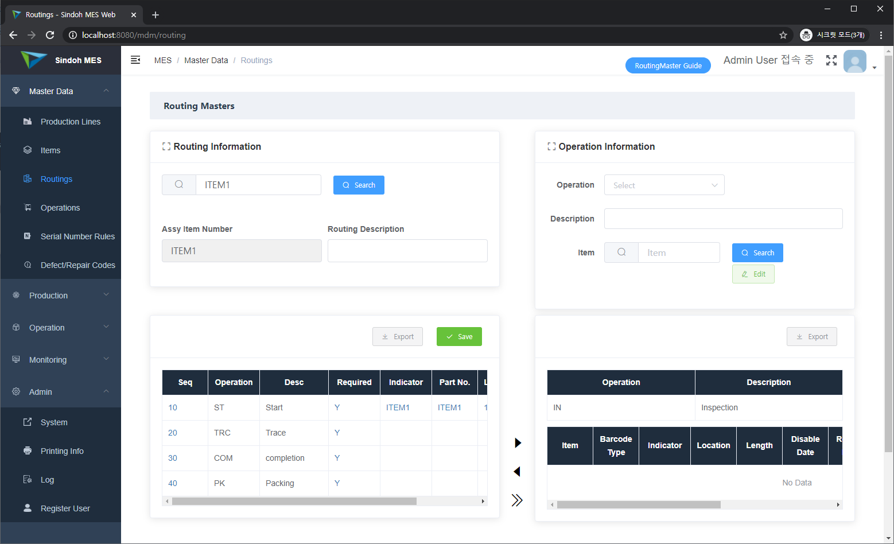
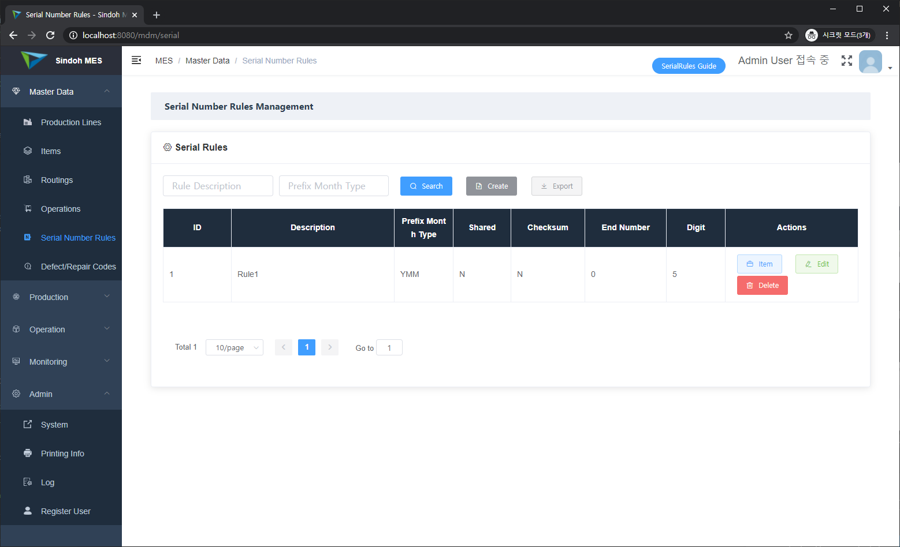
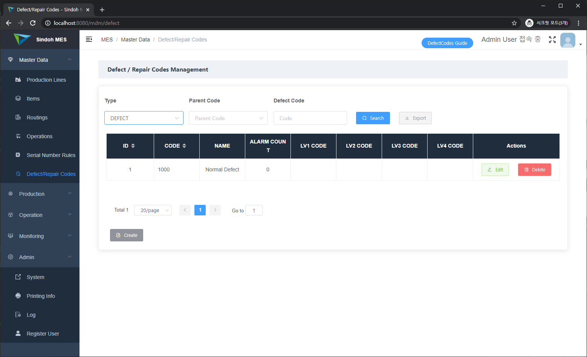

Eng / [한글](./manual_mdm.ko-KR.md)

## 1. Lines

### 1) Site Management

Before managing line management, you must consider site management.

Site management is not contained in this version but an one site is registered and the site can manage other management like line and production management.

You can see a site below the PostgreSQL query.

```SQL
select * from mes_sites;
```



The site information can be modified by database table update. However id value is must '1' and we will add site management activity.

### 2) Line Management

Line means production fundamental unit, it is manufacturing assembly line. Set one or more line and you can create and manage job order.



## 2. Items

Item means all of manufacturing units. They are products, materials, and sub a'ssy. Item information consists of below.

+ Item Information
+ Serial Information of the item
+ Packing Information of the item
+ Printout Information of the item



Serial Information is managed in the Serial Information page. Items can select the serial information in the serial list. However, packing and printout information is managed in the item page.

## 3. Operations

Operation means how to execute in the manufacturing assembly line. This version supports start, input parts, completion, inspection, and packing.



You can make no constraint operation name, but the operation name is also registered at the parameter.js in the Vue.js Front-end. Operation can be managed if you register the name in the file.

parameter.js

```
module.exports = {
  ...
  op_sol: 'ST',
  op_trace: 'TRC',
  op_eol: 'COM',
  op_packing: 'PK',
  op_inspection: 'IN',
  ...
}
```

If you set input parts operations, you can input the part detail information. 




## 4. Routings

Routing means operation information of the item, so items and operation information is assigned first.



The left block represents routing information of the searched item. You must search a certain item first, and if the item's routing information isn't exist, you can make a routing and detail information.

The right block represents operation information for routing registration. Using searched operations, you can add or remove routing information.


## 5. Serial Numbers

Most products have serial numbers. Serial number rules represents the one product or some similar products. Therefore serial rules is not depend on the one product and manage certain rules.

Normally serial number rules refer to date format(Year/Month/Day) and not fixed.




## 6. Defect/Repair Codes

A defect of a product occurs, you find a cause and if the product is needed to repair, you decide how to repair. Defect/Repair codes manage why defect occurs and how to repair.



Defect and repair codes divide 5-level type. If you want to improve this structure, please contact us.

<div style="text-align:right">
    <p><a href='./manual_system_mgmt.md'>→ System Management</a></p>
    <p><a href='./manual_production_mgmt.md'>→ Production Management</a></p>
    <p><a href='./manual_operation_exec.md'>→ Operation Execution and Monitoring</a></p>
</div>