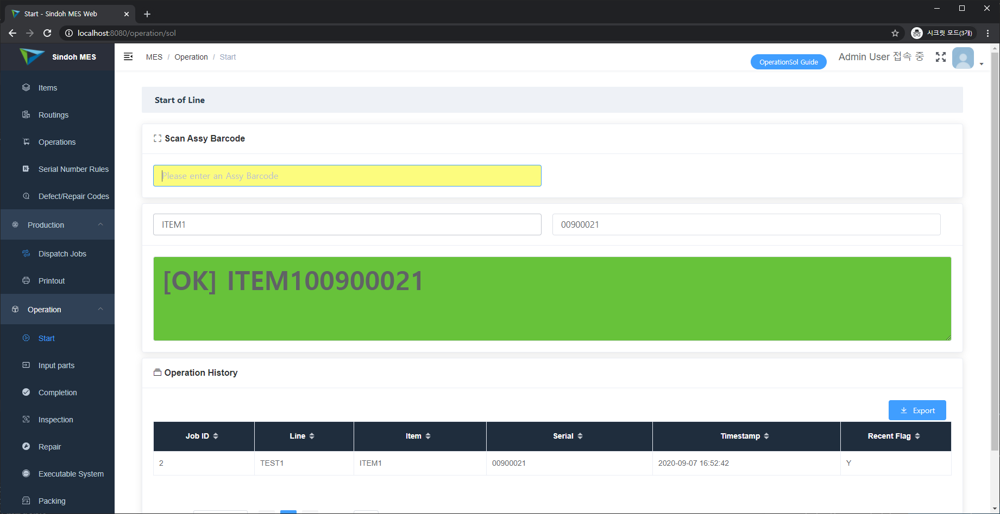
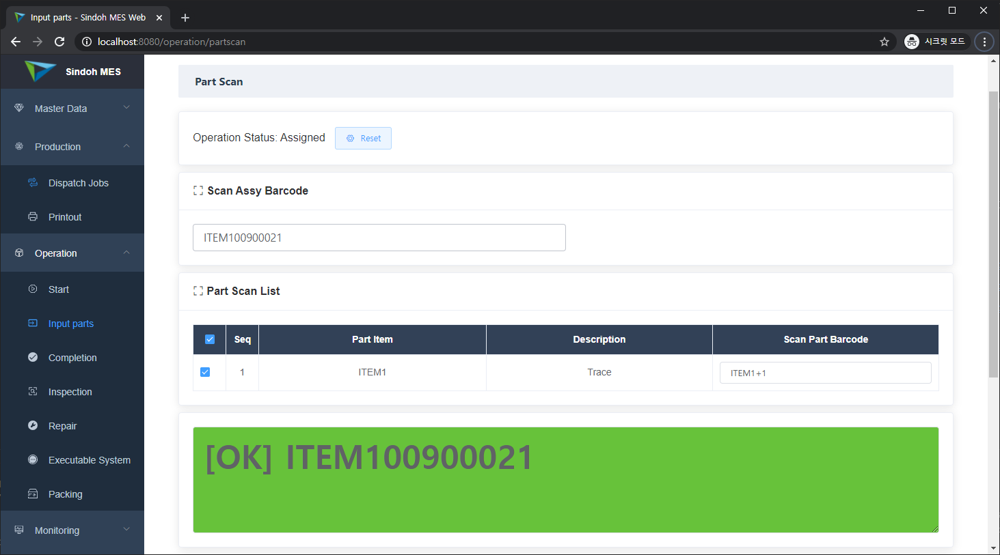
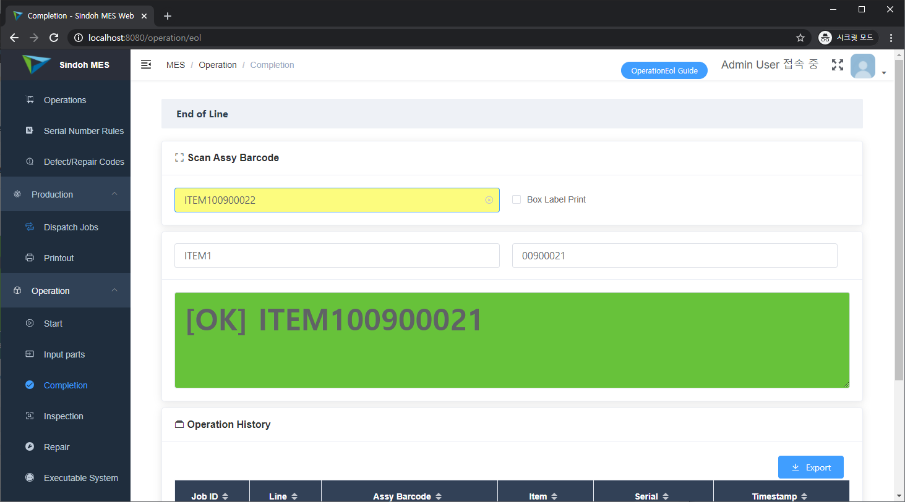
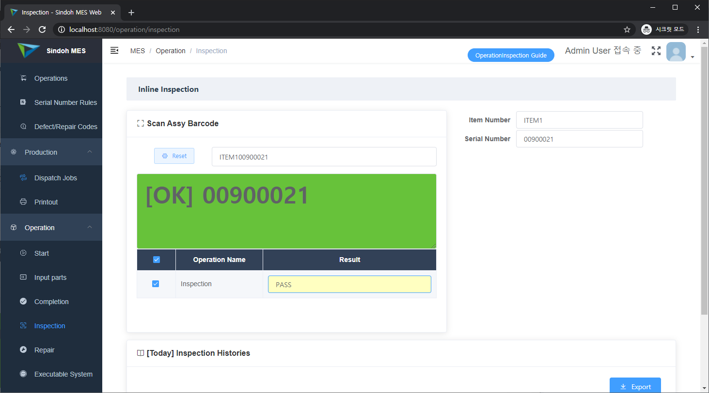
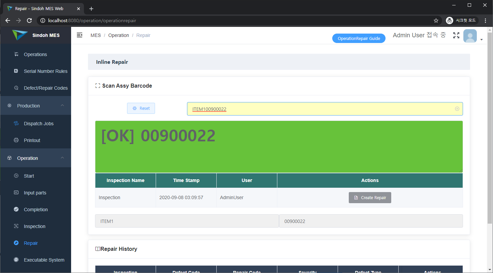
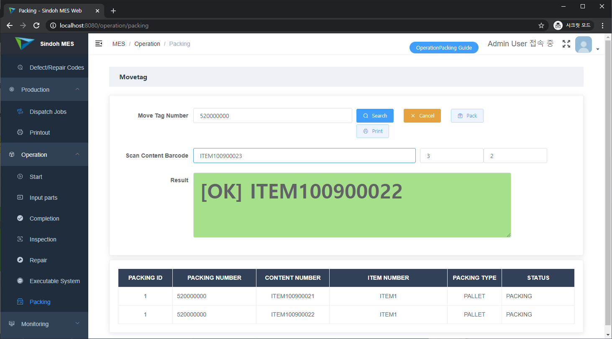
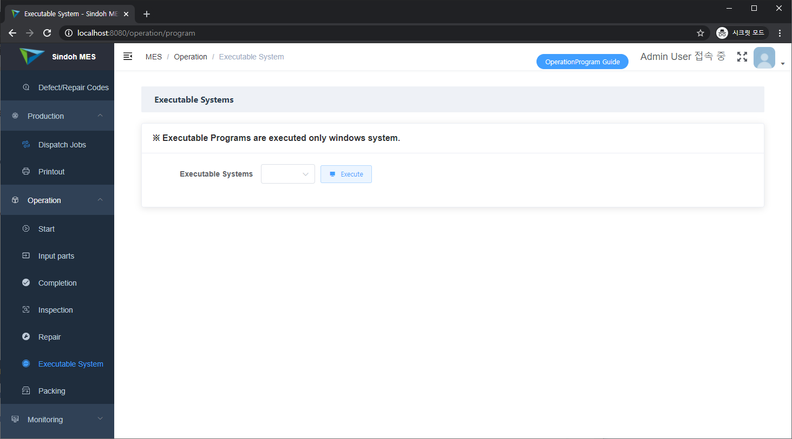
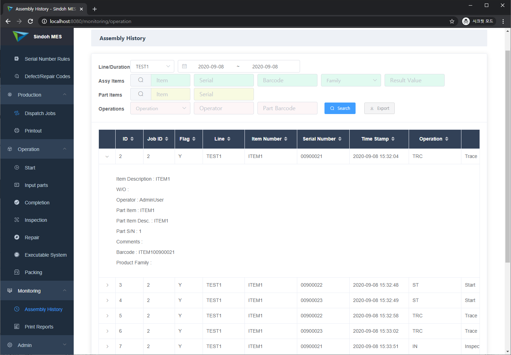

Eng / [한글](./manual_mdm.ko-KR.md)

## 1. Start

Start is start operation. It based on serial numbers in the job order. When you input the barcodes, start operation is applied. After applying start operation, you can see your today's start operation histories.

## 2. Input Parts

Input Parts is to input parts operation. It also based on serial numbers in the job order. When you input the barcodes, procedures are below.

+ First, the program refers to the barcode's item number.
+ Second, if the item's part information is already applied, you will see the traceable part operation list and input text box.
+ Third, if the item's part information is not applied, you will see the modal window for the traceable part operation selection.
+ Fourth, after above selection is completed, when you re-input the barcode you can see the second results.

When you input same item's barcodes you input parts directly, but when you input an other item's barcode you will see the modal window for re-setting.

## 3. Completion

Completion is production completion operation. When you think the production is completed, you can input the barcode in this page. This operation is related to manufacturing completion count, so we recommend interfacing ERP. In addition, when the completion operation is completed, we support the barcode's completion label.

## 4. Inline inspection

Inspection is in-line inspection of the job. It also based on the barcode. When you input the barcode, you can see the barcode's inspection operations. Now inspection result is supported by PASS/FAIL, but we will implement other values.

Normally inspection is represented by receiving inspection, in-line inspection, shipping inspection, but now the system has in-line inspection, and other inspections will be implemented.

## 5. Inline Repair

Repair is a repair operation for the barcode of inspection result is 'FAIL'. The barcode's repair operation has repair detail information. The information is why defect is occured, how to repair, and if the repair result is replacement what part is replaced.

## 6. Packing

Packing is packing operation for already completed product. Packing units are 'Pallet', 'Box' now, but we will improve packing management and add the packing units. 

Packing procedure is below.

+ First, input the product's barcode.
+ Second, if the packing number(or movetag number) is empty the number is generated automatically.
+ The product is applied in the packing number.
+ Packing unit count is setted in the packing information in the item page, so if the packing number's product count is full, packing status also be changed from packing to packed. After the packing operation, packing label printing is supported. Of course you can pack completely manually.

## 7. Executable Systems

Executable Systems is external programs in the production operation. Now it supports over Internet Explorer 10.0. This page will be able to remove, but we will decide your feedbacks.

## 8. Assembly Monitoring

Assembly Monitoring supports all of the histories in the operations and it supports various of the search conditions.

    
<a href='./manual_system_mgmt.md'>→ System Management</a>

    
<a href='./manual_mdm.md'>→ Master Data Management</a>

    
<a href='./manual_production_mgmt.md'>→ Production Management</a>

