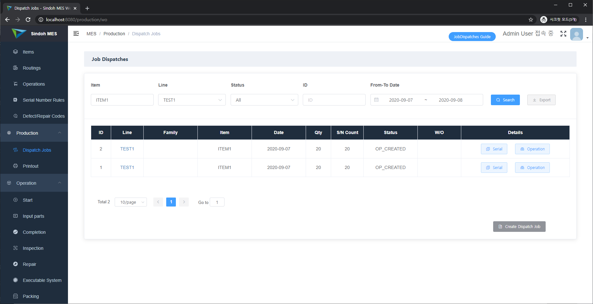
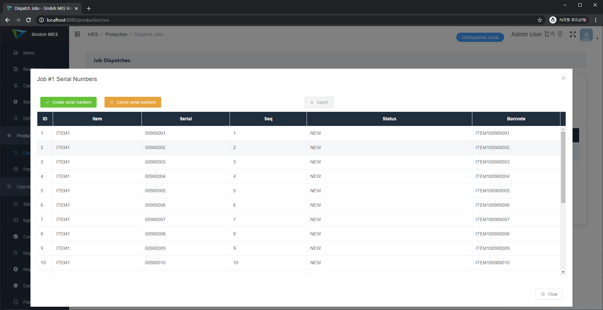
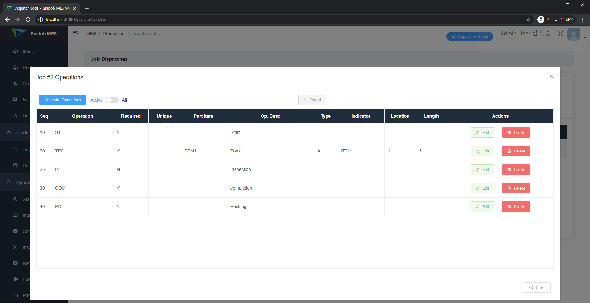
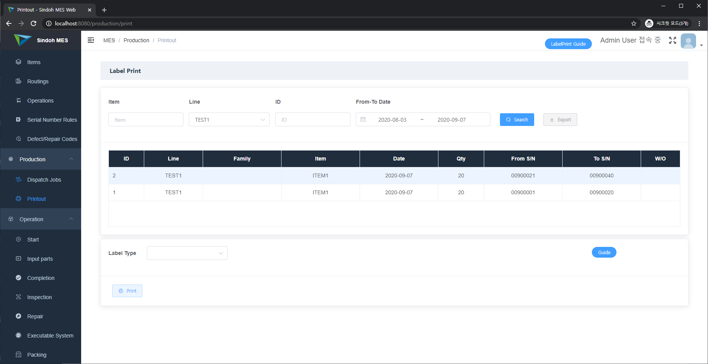

[Eng](manual_mdm.md) / 한글

## 1. Dispatch Jobs

Dispatch Jobs는 작업 오더(Job Order)를 생성하고 관리하기 위한 화면입니다. 작업 오더(이하 Job)는 ID를 단위로 생성되며, ID와는 별도로 오더 번호를 관리하기 위해서는 W/O(Work Order) 번호를 통해서 관리할 수 있습니다.

Job은 기본적으로 어떤 Line에서 어떤 품목을 몇 개를 생산할 것인지를 기본 단위로 합니다. 이에 따라 Job에서는 품목에 대한 일련번호도 생성 및 관리할 수 있고, 공정 작업 수행을 위한 공정도 생성합니다. 

일련번호는 품목에서 정의된 일련번호 규칙을 따라서 생성됩니다.

공정은 품목에서 정의된 라우팅 규칙을 따라서 생성되나, 라우팅 규칙을 반드시 따라야 할 필요는 없으며, Job 별로 특정 공정에 대한 세부 규칙을 변경하거나, 순서를 변경할 수 있습니다.

## 2. Printout

Printout은 Job을 단위로 출력물을 출력하는 용도로 사용됩니다. 출력물은 일반적으로 검사표가 될 수도 있고, 바코드 라벨이 될 수도 있으며, Box 포장을 위한 식별표 등이 될 수도 있습니다.

출력물은 시스템 관리의 품목 기준정보에서 정의한 출력물 정보를 바탕으로 구성되며, 출력물 정보에서 일련번호로 구성될 경우에는 모든 일련번호를 대상으로 출력할 수 있도록 하되 특정 일련번호 범위를 지정하여 출력할 수도 있습니다.

    
<a href='./manual_system_mgmt.ko-KR.md'>→ System Management</a>

    
<a href='./manual_mdm.ko-KR.md'>→ Master Data Management</a>

    
<a href='./manual_operation_exec.ko-KR.md'>→ Operation Execution and Monitoring</a>

