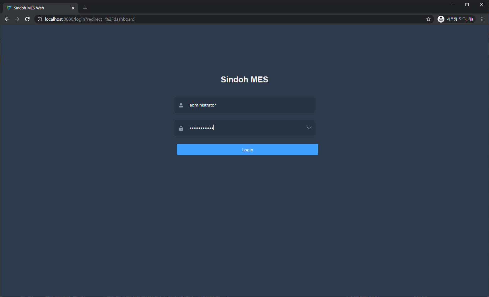
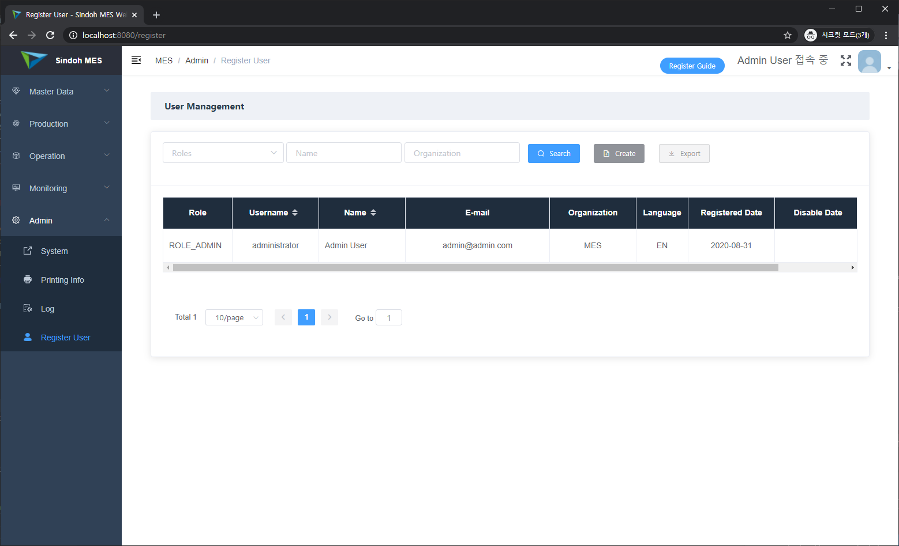
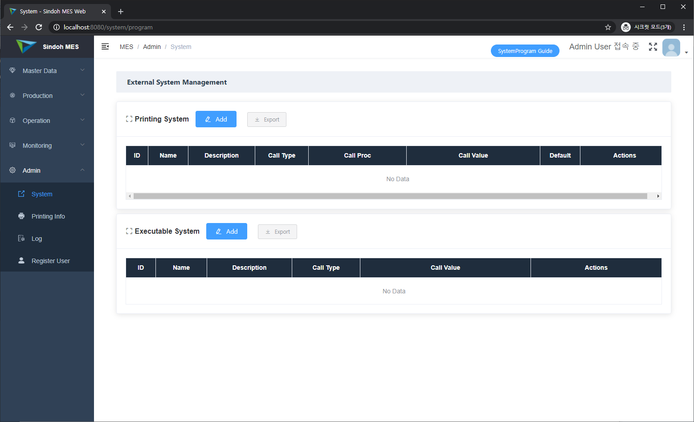
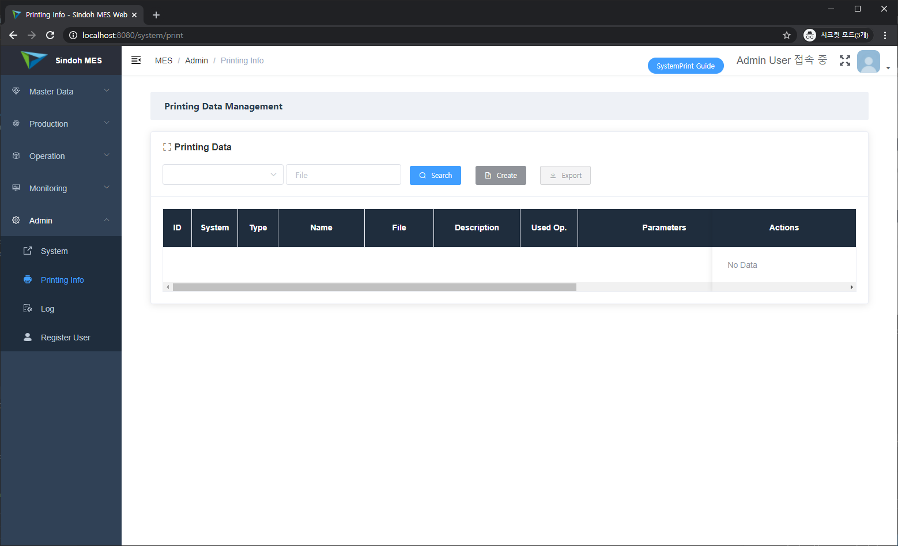
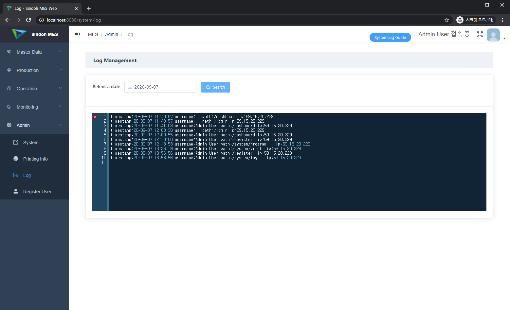

Eng / [한글](./manual_mdm.ko-KR.md)

## 1. Register User and Login

A manufacturing system is for factory workers and managers, so user registration is not allowed and an administrator registers workers. This version is not implemented by interfacing ERP employee information but if you want to interface the information, then you can implement the information when you want.

Initially, the system's account has only 'administrator'. 



When you use the administrator accounts, you can register employees and the employee's account can be used for login.



## 2. External System / Printing Info

External system means other systems related MES. It has executable system and printing system.

Executable System uses a certain external program as a manufacturing operation. However IE 10.0 based on Active-X. This activity will be able to deprecate.

Printing Systems uses to register production standby, operation, report. Now it has only a page but no activity, but we will add report programs used MIT License.



Printing Info is related to printing system in the exedutable system and registers real printout. the printout can be labels or reports.



Printing info contains below.

+ What uses printing program
+ Name, file, and detail information
+ Used at what operations
+ Parameters / Labels
+ Attributes of printout
+ QR Code URL
+ Used or not in the job order
+ Used or not serial numbers

Printout Operations in the mes4u are completion and packing operations, so you can register to print in the operations. 

Operation names refer to parameter.js in the Vue.js front-end. this values can be modified.

parameter.js

```
module.exports = {
  ...
  op_sol: 'ST',
  op_trace: 'OPS',
  op_eol: 'TS',
  op_packing: 'PK',
  op_inspection: 'IN',
  ...
}
```

For example, in the above values, 'op_eol' is completion operation name, and 'op_packing' is packing operation name. 

Parameters is used when labels are printed, and parameter names are parameter labels in the page.

Attributes are default parameters when register printout information of the item. However, they are not implemented now so it will be implemented on the next version.

Whether using job order means when print labels in the printout page, and whether serial rules means whether printout parameters has serial numbers or not.

Perhaps you don't appreciate printout information some issues, so if you want to use this information, please contact us.

## 3. Log

Log management is user's page connection list.



Log management supports below.

+ User IP Addresses
+ Pages
+ Error Infromation

However you refer to write API summary in the log.

<div style="text-align:right">
    <p><a href='./manual_mdm.md'>→ Master Data Management</a></p>
    <p><a href='./manual_production_mgmt.md'>→ Production Management</a></p>
    <p><a href='./manual_operation_exec.md'>→ Operation Execution and Monitoring</a></p>
</div>